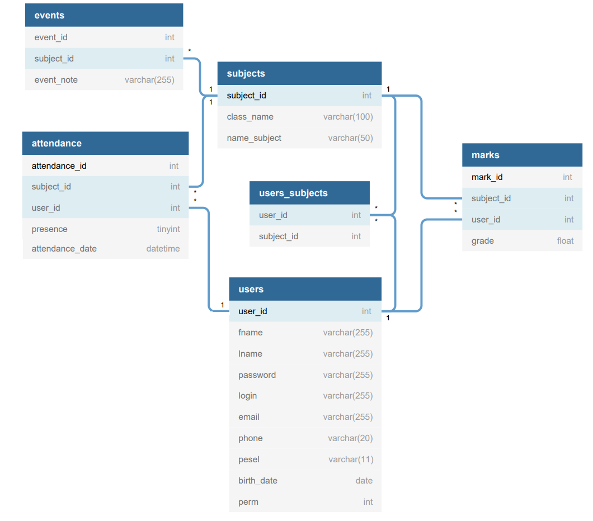

# gradebook-spring-mvc
Interfejs można podzielić na 3 główne panele zależne od praw użytkownika:

Panel Administratora:
- Panel zarządzania bazą użytkowników oraz przedmiotów (CRUD)
- Panel łączenie przedmiotów:
- Wyświetlanie aktualnie przypisanych przedmiotów dla uczniów oraz nauczycieli
- Przypisywanie/odbieranie nauczycielom praw do prowadzenia poszczególnych przedmiotów
- Dodawanie/usuwanie uczniów dla poszczególnych przedmiotów

Panel Nauczyciela:
- wybór przedmiotu z listy tych które dany nauczyciel prowadzi
- dodawanie/usuwanie nowych wydarzeń (event - dostępnych dla uczniów danego przedmiotu)
- dodawanie/usuwanie ocen uczniom wpisanym na wybrany przedmiot
- tworzenie nowych lekcji(obecność), możliwość edycji starych obecności klasy

Panel Studenta:
- wyświetlanie ocen z poszczególnych przedmiotów na które uczeń został zapisany
- wyświetlanie obecności z poszczególnych przedmiotów ucznia
- przegląd wydarzeń przypisanych z poszczególnych przedmiotów ucznia

Przykładowe dane do logowania:

ADMIN:
ID: 22
PW: 2

TEACHER:
ID: kpalka
PW: matematyka

STUDENT:
ID: amleko
PW: mleczko123

Diagram ERD:

